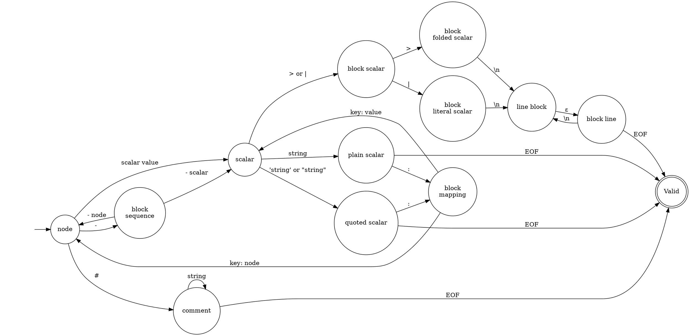
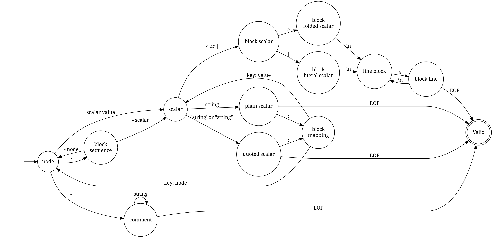

# Automaton representation

I did not draw the stack with the automaton. I tried my best to draw the automaton from the non-terminals in the grammar, with transitions to move between them (and loops for elements that go back to earlier non-terminals, or use `{ element }` in the grammar), so that it could validate words generated from the grammar.

I used the [DOT](https://graphviz.org/doc/info/lang.html) graph visualization language.  
The automaton is also exported as an SVG and a PNG.

## In DOT language

## In PNG format

## In SVG format

